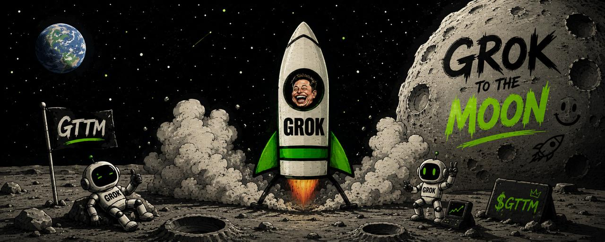
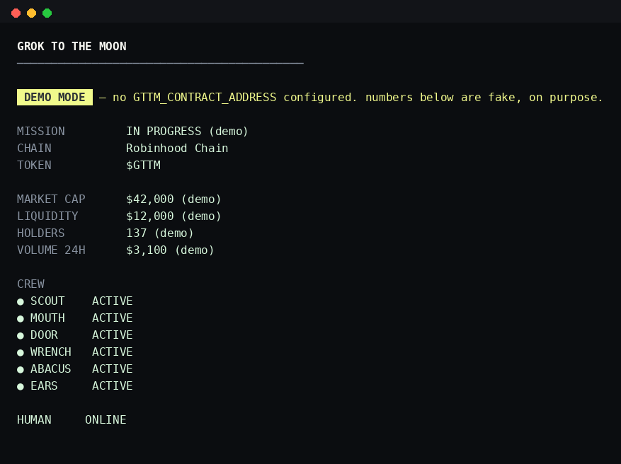
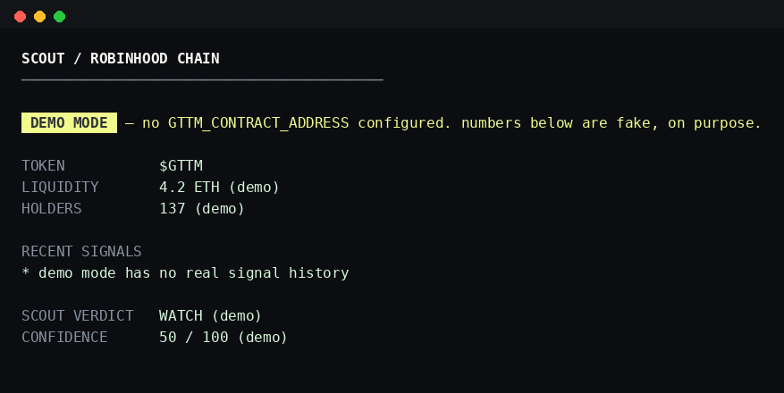
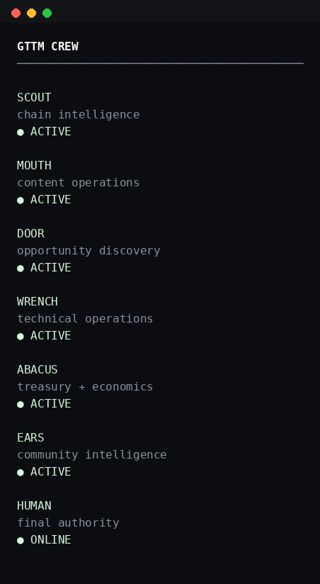
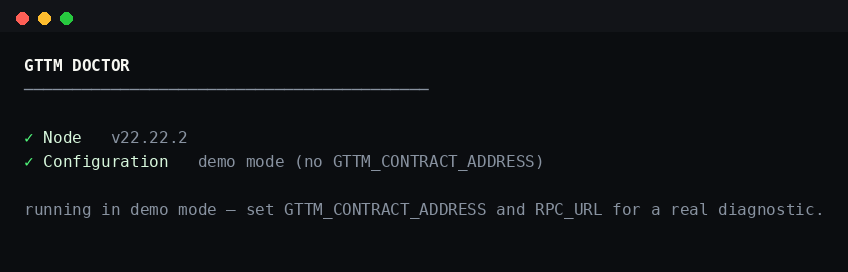

[](LICENSE)
[](package.json)
[](tsconfig.json)
[](https://docs.robinhood.com/chain/)
[](#safety)
[](#safety)

GTTM is a terminal you run to check on $GTTM on Robinhood Chain — a mission
control for six themed agents (SCOUT, MOUTH, DOOR, WRENCH, ABACUS, EARS) plus
HUMAN, the final authority. Under the hood it's a small read-only CLI: no
private keys, no signing, no trading. Every number it shows is either a real
chain read or explicitly labeled as unavailable — nothing here is invented to
look impressive.

v0.1 is a single-shot and polling terminal, not an autonomous system. The
"agents" are a deterministic rule engine and a set of named chain-read
functions, dressed as a crew — see [Signal engine](#signal-engine) below for
exactly what that means and doesn't mean.



*(HOLDERS is windowed activity, not a lifetime count — see [Known
limitations](#known-limitations).)*

## Features

- `gttm mission` — mission-control overview: market cap, liquidity, holders,
  volume, crew status, progress toward the next milestone.
- `gttm crew [agent]` — the crew roster, or one agent's own readout.
- `gttm scout` — SCOUT's chain-intelligence report with a deterministic
  verdict and confidence score.
- `gttm watch` — a live polling feed of transfers and swaps.
- `gttm scan` — a broader one-shot scan of the configured contract.
- `gttm treasury` — ABACUS's view of the public buyback wallet.
- `gttm moon` — progress toward the next market-cap milestone.
- `gttm doctor` — diagnostics: Node version, config, RPC, chain, contract,
  token metadata. Never crashes with a raw stack trace.
- **Demo mode** — with no contract configured, every command runs on
  obviously-fake, clearly-labeled mock data instead of refusing to run.

## Agent architecture

| Agent  | Role                    | v0.1 status |
| ------ | ----------------------- | ----------- |
| SCOUT  | chain intelligence      | real — liquidity, holder activity, buy/sell ratio, deterministic verdict |
| ABACUS | treasury + economics    | real — reads the public buyback wallet's transfers |
| WRENCH | technical operations    | real — RPC/connectivity checks |
| MOUTH  | content operations      | placeholder — no content pipeline in v0.1 |
| DOOR   | opportunity discovery   | placeholder — no partnership feed in v0.1 |
| EARS   | community intelligence  | placeholder — no social/sentiment source in v0.1 |
| HUMAN  | final authority         | you |

Three agents are real chain-read functions with a crew-flavored name. Three
are honestly-labeled placeholders reserved for later. `gttm crew <name>` says
which is which — it doesn't pretend a placeholder has output it doesn't.

## Signal engine



SCOUT's verdict (BULLISH / WATCH / BEARISH) comes from a small set of
explicit rules, not a model:

1. Liquidity trend vs. the last time you ran a command (cached locally in
   `.gttm-state.json`) — no history yet means this rule doesn't fire.
2. Active-address-count trend, same basis.
3. Buy/sell ratio in the scanned block window.

Confidence scales down when fewer rules had data to fire on. There is no
hidden weighting and no claim of machine learning — this is v0.1's stated
architecture, built so an actual LLM/agent layer can slot in later without
changing the CLI surface.

## Installation

```bash
git clone <this-repo>
cd gttm
npm install
npm run build
node bin/gttm.js mission   # runs in demo mode with no config
```

## Configuration

```bash
cp .env.example .env
```

| Variable                   | Required for live mode | Notes |
| --------------------------- | :---------------------: | ----- |
| `RPC_URL`                  | yes | from your own provider — see `docs.robinhood.com/chain` |
| `GTTM_CONTRACT_ADDRESS`    | yes | leave empty to stay in demo mode |
| `POOL_ADDRESS`             | for price/liquidity | only once the token has a Uniswap-v2-style pool (post pons-v2-graduation) |
| `BUYBACK_WALLET`           | for `treasury` | the public wallet from roadmap Phase 3 |
| `NEXT_MILESTONE_USD`       | no | your own target, not fetched data |
| `PAIR_ASSET_COINGECKO_ID`  | no | for USD conversion; degrades to `DATA UNAVAILABLE` if unset or unreachable |

No private key is ever requested, read, or stored anywhere in this codebase.

## Usage



```bash
gttm mission
gttm crew
gttm crew scout
gttm scout
gttm watch
gttm scan
gttm treasury
gttm moon
gttm doctor
gttm --help
gttm --version
```

## Architecture

```
src/
  cli.ts              entry point (commander)
  commands/           one file per CLI command
  agents/             crew readouts — real for scout/abacus/wrench,
                       honest placeholders for mouth/door/ears
  chain/              viem client, token/liquidity/holder/activity reads
  core/               config, signal engine, formatting, demo data, state cache
  ui/                 terminal chrome, tables, progress bars
```

No unnecessary abstraction — a command calls chain functions directly and
formats the result. The agent layer is a thin, honestly-labeled wrapper
around the same functions, not a second implementation.

## Known limitations

Stated plainly instead of hidden:

- **HOLDERS is windowed, not lifetime.** Getting a true lifetime holder count
  needs an indexer over full transfer history; this CLI scans a recent block
  window (`SIGNAL_WINDOW_BLOCKS`) and reports *addresses active in that
  window*, labeled with an asterisk everywhere it appears.
- **DEPLOYER is not discoverable in v0.1.** Finding the real deployer needs
  either an indexer or an archive-node trace of the creation transaction.
  `gttm scan` says this outright rather than guessing.
- **Pre-graduation pricing is not implemented.** If $GTTM is still on the
  pons v2 bonding curve, price and liquidity follow the curve's own integer
  math, not simple pool reserves. This repo doesn't hardcode a curve address
  or ABI it can't verify — see `src/chain/pons-gap.ts` for exactly what's
  missing and where to get it. `price`/`liquidity`-dependent fields report
  `DATA UNAVAILABLE` until `POOL_ADDRESS` is set post-graduation.
- **USD figures depend on an external price feed** (CoinGecko, no API key).
  If it's unreachable, USD numbers show `DATA UNAVAILABLE` and pair-asset
  (ETH) figures are shown instead — nothing is estimated silently.

## Safety



- Read-only. No wallet signing, no automated transactions, no ability to
  move funds — v0.1 doesn't have a code path that could.
- No private key is ever requested or stored.
- Demo mode is unmistakable: a `DEMO MODE` banner on every command, and every
  demo number is a round, clearly-fake figure.
- `doctor` never lets a raw stack trace reach the terminal; every failure
  path returns a human-readable reason.

## Roadmap

Not implemented yet, deliberately out of scope for v0.1, but the module
boundaries (`agents/`, `core/signals.ts`) are shaped so these can slot in
without a rewrite:

- Real LLM-powered agents behind the same crew interface
- A social-sentiment source for EARS
- Automated content generation for MOUTH
- Wallet-intelligence and deployer-history lookups for DOOR/SCOUT
- Telegram/Discord and X monitoring integrations
- Agent-to-agent communication and a human-approval queue
- A plugin system for third-party agents

## Contributing

Issues and PRs welcome. Keep changes small, keep the CLI output honest — if a
number can't be verified from the chain (or another cited source), it should
say `DATA UNAVAILABLE`, not a plausible-looking guess.

## License

MIT.
