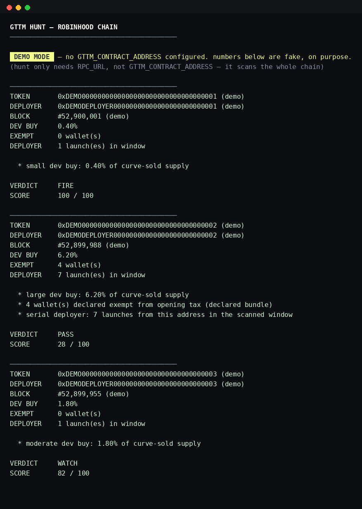

# GTTM

### mission control for Robinhood Chain.


[](https://github.com/leopardracer/GTTM/actions/workflows/ci.yml)
[](LICENSE)
[](package.json)
[](tsconfig.json)
[](https://docs.robinhood.com/chain/)
[](#safety)
[](#safety)

GTTM is a mission-control cockpit for discovering and evaluating new
opportunities on Robinhood Chain. Sniping a fresh Pons V2 launch is the
primary use case today, but GTTM itself is the intelligence-and-interface
layer — not an automated trading bot. It detects, scores, and shows you the
reasons; deciding (and, later, executing) stays a human action.

```
CURRENT — IMPLEMENTED
──────────────────────────────────
Robinhood Chain
      ↓
Pons V2
      ↓
GTTM Intelligence
      ↓
Launch Detection
      ↓
On-chain Analysis     (dev buy size, tax-exempt wallets, deployer pattern)
      ↓
Signal / Score
      ↓
GTTM Cockpit
      ↓
Human Decision
      ↓
optional Snipe        (not implemented — no execution path exists in v0.3)

NEXT — PLANNED, NOT BUILT YET
──────────────────────────────────
Wallet Intelligence   (deployer history beyond a single window — see DOOR)
Market Intelligence   (cross-token market data, beyond $GTTM's own dashboard)
```

`gttm hunt` is what runs the "CURRENT" column above today: it watches the
Pons V2 factory on Robinhood Chain for every new token launch, scores each
one against a small set of explicit, readable rules (dev buy size, declared
tax-exempt wallets, serial deployers), and shows you the result. It's
read-only end to end — no private key, no signing, no automated trade — a
cockpit for a human to make the call, not a bot that trades for you.



GTTM also ships a secondary feature: a dashboard for the project's own
$GTTM token specifically (`mission`, `scout`, `scan`, `treasury`, `moon`,
`crew`) — see [$GTTM token dashboard](#gttm-token-dashboard) further down.
That's the part that used to be framed as "six AI agents"; it's still here
and still real, just not the headline anymore.

## Sniper engine

`gttm hunt` is the core loop:

1. **Detect** — scan the Pons V2 factory (`0x7ed598bc...`) for `TokenLaunched`
   events in a recent block window. No token filter — this is every launch
   on the chain, not just $GTTM's own.
2. **Enrich** — for each launch, read the dev's own first buy on that
   token's bonding curve (size, effective tax), how many wallets were
   declared exempt from the opening snipe tax, and how many other launches
   the same deployer made in the same window (all from data already fetched
   — no extra indexer).
3. **Score** — a small, explicit rule set (not a model — see below) turns
   that into a 0-100 score and a `FIRE` / `WATCH` / `PASS` verdict with the
   reasons spelled out.
4. **Decide** — that's the human's job. v0.3 has no execution path at all;
   see [Safety](#safety).

### Scoring rules

`core/huntScore.ts` is the whole model — read it, it's short:

| Signal | What it means | Effect |
| --- | --- | --- |
| Dev buy > 5% of curve-sold supply | Deployer took a large slice of the tradeable supply for themselves | red flag |
| Dev buy 1-5% | Moderate — worth noting, not alarming | minor flag |
| Any wallets declared exempt from opening tax | A "bundle" — insiders got in before the snipe-tax window applied to them | red flag, scales with count |
| Same deployer launched >1 token in the window | Mass-launching pattern, often low-effort | red flag, scales with count |
| Dev's own buy paid less tax than the opening rate | Dev may have self-exempted | flag |

No signal here predicts price or claims to know anything about the future —
they flag patterns worth a human's attention, same philosophy as
[Signal engine](#signal-engine) below.

### Known limitations (sniper engine)

- **One RPC round-trip per detected launch** to fetch its dev-buy and
  exempt-wallet events. Fine for a normal launch window; on a very busy
  window with a slow public RPC, `hunt` will be slow — a batched multicall
  is the obvious next optimization, not yet done.
- **No execution.** `hunt` only detects and scores. There's no code path in
  this repo that buys anything — see [Safety](#safety).
- **No live polling feed yet.** `hunt` is a one-shot scan of the recent
  window (`SIGNAL_WINDOW_BLOCKS`), same as `scan`, not a continuous stream
  like `watch`. A `--follow` mode is the natural next step.

## $GTTM token dashboard

The rest of this README (below) describes the token-specific dashboard:
`mission`, `crew`, `scout`, `scan`, `treasury`, `moon`, `watch`, `doctor`.
This is $GTTM checking on itself, not the sniper engine — it needs
`GTTM_CONTRACT_ADDRESS` configured, while `hunt` only needs `RPC_URL`.

v0.1 is a single-shot and polling terminal, not an autonomous system. The
"agents" are a deterministic rule engine and a set of named chain-read
functions, dressed as a crew — see [Signal engine](#signal-engine) below for
exactly what that means and doesn't mean.

**v0.2** wired SCOUT and ABACUS directly into the real Pons V2 launchpad
contracts on Robinhood Chain (factory, per-token bonding curve) — see [Pons
V2 integration](#pons-v2-integration) for what that closes and what it
doesn't. **v0.3** reuses that same integration, pointed at the whole chain
instead of one token, to build the sniper engine above.


*(HOLDERS is a real lifetime count when the token has a Pons V2 launch
record; see [Known limitations](#known-limitations) for when it isn't.)*

## Features

- `gttm hunt` — **the sniper cockpit.** Every new Pons V2 launch on the
  chain, scored. See [Sniper engine](#sniper-engine).
- `gttm mission` — $GTTM's own mission-control overview: market cap,
  liquidity, holders, volume, crew status, roadmap phase.
- `gttm crew [agent]` — the $GTTM crew roster, or one agent's own readout.
- `gttm scout` — SCOUT's chain-intelligence report on $GTTM with a
  deterministic verdict and confidence score.
- `gttm watch` — a live polling feed of $GTTM transfers and curve trades.
- `gttm scan` — a broader one-shot scan of the configured $GTTM contract.
- `gttm treasury` — ABACUS's view of $GTTM's public buyback wallet.
- `gttm moon` — $GTTM's progress on its own 6-phase roadmap.
- `gttm doctor` — diagnostics: Node version, config, RPC, chain, contract,
  token metadata. Never crashes with a raw stack trace.
- **Demo mode** — with no contract configured, every command runs on
  obviously-fake, clearly-labeled mock data instead of refusing to run.

## Agent architecture

| Agent  | Role                    | Status |
| ------ | ----------------------- | ----------- |
| SCOUT  | chain intelligence      | real — liquidity, holder activity, buy/sell ratio, deterministic verdict |
| ABACUS | treasury + economics    | real — reads the public buyback wallet's transfers |
| WRENCH | technical operations    | real — RPC/connectivity checks |
| MOUTH  | content operations      | placeholder — no content pipeline in v0.1 |
| DOOR   | opportunity discovery   | placeholder — no partnership feed in v0.1 |
| EARS   | community intelligence  | placeholder — no social/sentiment source in v0.1 |
| HUMAN  | final authority         | you |

Three agents are real chain-read functions with a crew-flavored name. Three
are honestly-labeled placeholders reserved for later. `gttm crew <name>` says
which is which — it doesn't pretend a placeholder has output it doesn't.

## Mission roadmap ($GTTM phases)

`gttm moon` tracks the actual 6-phase roadmap from
[groktothemoon.foundation](https://www.groktothemoon.foundation), not a
generic single milestone. Two of the six phases have a real number attached
(Phase 4: $1M market cap, Phase 5: $2M) — those are computed from a live
market cap when one's available. The other four (launch complete, community
push, the buyback wallet, and "find a bigger moon") have no on-chain number
to check, so their status is the project's own stated claim, labeled
`(declared)` rather than presented as chain-verified — see `src/core/roadmap.ts`.

```
$ gttm moon

ROADMAP
[x] PHASE 1  LIFT OFF                 DONE (declared)
[~] PHASE 2  MAKE NOISE               RUNNING (declared)
[~] PHASE 3  EVERY FEE GOES BACK IN   RUNNING (declared)
[ ] PHASE 4  THE EXCHANGE CALLS       $1,000,000 MCAP
[ ] PHASE 5  GET LISTED               $2,000,000 MCAP
[ ] PHASE 6  YOU KNOW THIS PART       PENDING
```

## Pons V2 integration

$GTTM launches through [Pons](https://www.ponsfamily.com/launchpad), Robinhood
Chain's bonding-curve launchpad. v0.2 talks to the real Pons V2 contracts
directly — addresses and event signatures below are sourced from
[Bitquery's Pons documentation](https://docs.bitquery.io/docs/blockchain/robinhood/pons-api/),
which states every topic0 was verified against the deployed contract source.
They're not this project's own reverse-engineering:

| Contract | Address | Used for |
| --- | --- | --- |
| `PonsV2LaunchFactory` | `0x7ed598bcef8bd9edd8c97a195c6d13f40801ec7e` | `TokenLaunched` → real deployer, curve address, graduation threshold |
| Per-token bonding curve | one per token, from `TokenLaunched.curve` | `CurveBuy` / `CurveSell` → real pre-graduation price, volume, graduation progress |
| `PonsV2MemeHook` / `PonsV2LaunchLocker` / v4 `PoolManager` | see `src/chain/pons.ts` | excluded from holder counts — they custody protocol balances, not real holders |

This closes three of v0.1's stated gaps:

- **Deployer** (`gttm scan`) — read directly from `TokenLaunched.deployer`, no
  archive-node trace needed.
- **Holder count** (`mission` / `scout` / `scan`) — scans from the token's
  actual launch block instead of an arbitrary recent window, so it's a real
  lifetime count, not a windowed guess. Protocol contracts are excluded (see
  table above).
- **Pre-graduation price/liquidity/activity** — read from the curve's own
  `CurveBuy`/`CurveSell` events and its live quote-asset balance, instead of
  reporting `DATA UNAVAILABLE` for every token that hasn't graduated yet.

It also **surfaced** a gap that v0.1 didn't know about: post-graduation, a
Pons token trades in a real Uniswap v4 pool, which has no per-pool contract
with `getReserves()` the way v0.1 assumed — v4 pools live inside a shared
`PoolManager` singleton keyed by `PoolId`. Reading a live price out of that
needs a StateView/quoter call this toolkit doesn't implement yet. Rather than
ship code that would silently fail (or worse, silently misread) against a
real graduated pool, `gttm scout`/`scan`/`mission` report a graduated token's
price/liquidity as unavailable with the reason stated — see [Known
limitations](#known-limitations).

## Signal engine


SCOUT's verdict (BULLISH / WATCH / BEARISH) comes from a small set of
explicit rules, not a model:

1. Liquidity trend vs. the last time you ran a command (cached locally in
   `.gttm-state.json`) — no history yet means this rule doesn't fire.
2. Holder-count trend, same basis.
3. Buy/sell ratio on the curve since launch.

Confidence scales down when fewer rules had data to fire on. There is no
hidden weighting and no claim of machine learning — this is v0.1's stated
architecture, built so an actual LLM/agent layer can slot in later without
changing the CLI surface.

## Installation

```bash
git clone <this-repo>
cd gttm
npm install
npm run build
node bin/gttm.js mission   # runs in demo mode with no config
```

## Configuration

```bash
cp .env.example .env
```

| Variable                   | Required for live mode | Notes |
| --------------------------- | :---------------------: | ----- |
| `RPC_URL`                  | yes (all live commands) | from your own provider — see `docs.robinhood.com/chain`. This alone is enough for `gttm hunt`. |
| `GTTM_CONTRACT_ADDRESS`    | for the [token dashboard](#gttm-token-dashboard) only | not needed for `hunt` — leave empty and `hunt` still runs live off `RPC_URL` alone; the token-dashboard commands fall back to demo mode without it |
| `POOL_ADDRESS`             | no | reserved for a future post-graduation v4 reader — not used pre-graduation, that's auto-discovered (see [Pons V2 integration](#pons-v2-integration)) |
| `BUYBACK_WALLET`           | for `treasury` | the public wallet from roadmap Phase 3 |
| `PAIR_ASSET_COINGECKO_ID`  | no | for USD conversion; degrades to `DATA UNAVAILABLE` if unset or unreachable |

No private key is ever requested, read, or stored anywhere in this codebase.

## Usage


```bash
gttm hunt
gttm mission
gttm crew
gttm crew scout
gttm scout
gttm watch
gttm scan
gttm treasury
gttm moon
gttm doctor
gttm --help
gttm --version
```

## Architecture

```
src/
  cli.ts              entry point (commander)
  commands/            one file per CLI command (hunt.ts is the sniper cockpit)
  agents/              $GTTM crew readouts — real for scout/abacus/wrench,
                        honest placeholders for mouth/door/ears
  chain/               viem client, token reads, and Pons V2 integration
    pons.ts             real Pons V2 addresses + event ABIs (sourced, not guessed)
    hunt.ts             sniper engine: scans ALL launches on the factory
    launch.ts           per-token launch record + bonding-curve state ($GTTM dashboard)
    liquidity.ts        price/liquidity — curve pre-graduation, gap post-graduation
    holders.ts          real lifetime holder count from the launch block
    transactions.ts     buy/sell activity from curve events + buyback tracking
  core/
    huntScore.ts         the sniper engine's whole scoring model — read it, it's short
    signals.ts           $GTTM dashboard's deterministic verdict engine
    roadmap.ts           $GTTM's 6-phase roadmap tracker
    config.ts, format.ts, demo.ts, state.ts, price-feed.ts
  ui/                  terminal chrome, tables, progress bars
```

No unnecessary abstraction — a command calls chain functions directly and
formats the result. The agent layer is a thin, honestly-labeled wrapper
around the same functions, not a second implementation.

## Known limitations

Stated plainly instead of hidden:

- **Post-graduation price/liquidity/activity isn't read yet.** Once a Pons
  token graduates to its Uniswap v4 pool, reading a live price needs a
  StateView/quoter contract call against the shared `PoolManager` singleton
  (keyed by `PoolId`, not a per-pool address) — v0.1 assumed a simpler
  per-pool contract that doesn't actually exist for v4. `gttm scout`/`scan`/
  `mission` report `DATA UNAVAILABLE` with this reason for a graduated token
  rather than guess. See [Pons V2 integration](#pons-v2-integration).
- **ERC-20 quote-asset curves aren't priced yet.** Pons also supports USDG,
  cbBTC, and tokenized stocks/ETFs as the quote asset. Curve liquidity
  currently reads a direct ETH balance on the curve contract; a non-ETH quote
  asset needs that token's own `balanceOf(curve)` instead, which isn't wired
  up — `liquidityPairAsset` reports `null` with the reason stated in that
  case, rather than assuming ETH.
- **Holder count needs a real Pons launch record.** If the configured
  address isn't a Pons V2 launch (or is a V1 launch, which used a different
  factory and no bonding curve), holders/activity fall back to a recent
  block-window scan instead of the token's real lifetime history, and the
  output says so.
- **DOOR and EARS are still placeholders.** Deployer-history lookups (DOOR)
  and social-sentiment data (EARS) aren't implemented — see
  [Development roadmap](#development-roadmap).
- **USD figures depend on an external price feed** (CoinGecko, no API key).
  If it's unreachable, USD numbers show `DATA UNAVAILABLE` and pair-asset
  (ETH) figures are shown instead — nothing is estimated silently.

## Safety


- Read-only, including `hunt`. No wallet signing, no automated transactions,
  no ability to move funds — there is no code path in this repo that
  submits a transaction. Detection and scoring only.
- No private key is ever requested or stored, anywhere, including for the
  sniper engine — a future execution mode (see [Sniper
  engine](#sniper-engine)) would need one, and doesn't exist yet.
- Demo mode is unmistakable: a `DEMO MODE` banner on every command, and every
  demo number is a round, clearly-fake figure.
- `doctor` never lets a raw stack trace reach the terminal; every failure
  path returns a human-readable reason.

## Development roadmap

Not implemented yet, deliberately out of scope for v0.1/v0.2, but the module
boundaries (`agents/`, `core/signals.ts`) are shaped so these can slot in
without a rewrite:

- Real LLM-powered agents behind the same crew interface
- A social-sentiment source for EARS
- Automated content generation for MOUTH
- **Wallet Intelligence** — deployer-history lookups for DOOR (how many prior
  launches an address has, how many graduated) — the deployer's *address*
  is already real as of v0.2, see [Pons V2 integration](#pons-v2-integration);
  the history isn't
- **Market Intelligence** — cross-token market data beyond $GTTM's own
  dashboard (volume/liquidity comparisons across launches, not just one token)
- Post-graduation v4 pool pricing (see [Known limitations](#known-limitations))
- Telegram/Discord and X monitoring integrations
- Agent-to-agent communication and a human-approval queue
- A plugin system for third-party agents

## Contributing

Issues and PRs welcome. Keep changes small, keep the CLI output honest — if a
number can't be verified from the chain (or another cited source), it should
say `DATA UNAVAILABLE`, not a plausible-looking guess.

Run `npm test` before opening a PR (builds with `tsc`, then runs the test
suite on Node's built-in test runner — no extra test framework dependency).
CI runs the same build + test + demo-mode smoke test on every push, on
Node 20.x and 22.x.

## License

MIT.
